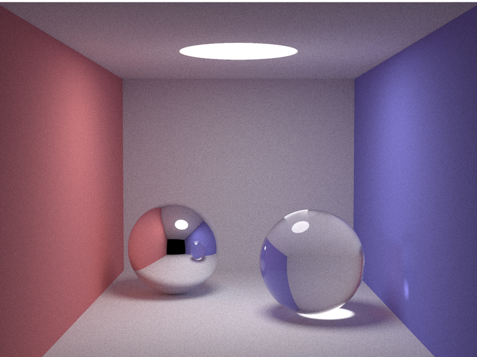

# smallpt-cr

A Crystal port of [smallpt](http://www.kevinbeason.com/smallpt/), Kevin Beason's
famous ~100-line unbiased path tracer, written to explore the performance gap
between optimized C++ and optimized Crystal.



*The classic smallpt scene: two diffuse walls (red and blue), a mirror sphere
and a glass sphere, lit only by a spherical light, rendered at 800 samples per
pixel. Rendered by the Crystal implementation.*

## What is smallpt?

smallpt is a global illumination renderer written by Kevin Beason in 2006 as a
demonstration that physically-based rendering could fit in about 100 lines of
C++. It is a *path tracer*: instead of computing light analytically, it shoots
millions of random rays from the camera and follows their bounces around the
scene, averaging the results. Given enough samples this converges to the
mathematically correct image — no shortcuts, no fake ambient occlusion maps.

Its tricks are the classics of Monte Carlo rendering:

- **Cosine-weighted importance sampling** for diffuse bounces, so more rays go
  where the lighting contribution is largest.
- **Russian roulette** to randomly kill deep ray paths, keeping renders finite
  without biasing the result.
- **Fresnel-based probabilistic reflection/refraction** for the glass sphere.
- **Tent-filtered supersampling** with 2×2 subpixels per camera sample.

Because it is tiny, self-contained and computationally brutal, smallpt became a
popular language benchmark: ports exist for dozens of languages, and "how fast
can your language render N samples" became a standard shootout.

## This project

This repository contains:

| File | Description |
|---|---|
| `smallpt.cpp` | The original algorithm, compiled with `g++ -O3` |
| `src/smallpt.cr` | A faithful Crystal port, built with `shards build --release` |

The port is deliberately *algorithmically identical*: same scene, same camera,
same sampling strategy, same math. Both implementations are single code paths
that were then parallelized in the idiomatic way for each language:

- **C++**: OpenMP (`#pragma omp parallel for` over scanlines), as in the
  original source.
- **Crystal**: fibers distributed over an execution context sized to the CPU
  count, with each row claiming work from a shared atomic counter.

Each row has its own deterministic random number stream, so output is
reproducible regardless of thread scheduling.

### Literate documentation

The Crystal source is written in literate style: the prose comments that
explain the algorithm are the documentation. You can read it rendered as a
side-by-side annotated source at `docs/smallpt.cr.html`, regenerated with:

```console
$ crycco src/smallpt.cr
```

## Expressiveness: C++ vs Crystal

The C++ original is famously terse — it reads like compressed mathematics:
one-letter variables (`r`, `f`, `nl`, `ddn`), operator overloading doing double
duty (`%` is cross product), implicit conversions everywhere, and all three
material types dispatched inside one deeply nested function. It's brilliant,
and nearly unreadable without the accompanying notes.

The Crystal port keeps the same structure but can afford to be descriptive
without any runtime cost, because structs are unboxed value types:

- `record Vec` with named methods (`#norm`, `#dot`, `#mult`) instead of
  overloaded operators.
- A `ReflT` enum (`Diffuse`, `Specular`, `Refractive`) instead of integer
  constants, dispatched with an exhaustive `case`.
- Descriptive names throughout: `subpixel_x`, `accumulated`,
  `reflection_type`, `reflected_ray`.
- Each material's shading logic lives in its own branch or helper method
  (`radiance_refractive`) rather than nested ternaries.

The interesting result: **none of that readability costs performance**. The
Crystal version compiles down to essentially the same machine code patterns —
stack-allocated vectors, no GC pressure in the hot loop, monomorphic dispatch.

## Performance

Measured on a 12-core desktop (1024×768, best of runs):

| Implementation | 128 spp | Speedup vs own serial |
|---|---|---|
| C++ `-O3`, single thread | ~114.8s | 1.0x |
| Crystal `--release`, single thread | ~120.5s | 1.0x |
| C++ `-O3 -fopenmp`, 12 threads | ~14.6s | 7.9x |
| Crystal `--release`, execution contexts | ~15.1s | 8.0x |

**The gap is about 5%**, both serial and parallel — effectively parity.
Crystal's ahead-of-time compilation, unboxed structs, and lack of garbage
collection pressure in numeric hot loops make it a very credible replacement
for C++ on this kind of workload.

Caveats worth knowing:

- The comparison uses `--release`; debug-mode Crystal is roughly an order of
  magnitude slower.
- Since Crystal 1.21, programs start with parallelism set to 1; you must call
  `Fiber::ExecutionContext.default.resize(worker_count)` (as this port does)
  or set `CRYSTAL_WORKERS`.

## Building and running

```console
$ shards install          # no dependencies, but harmless
$ shards build --release  # builds bin/smallpt
$ g++ -O3 -o bin/smallpt-cpp smallpt.cpp            # serial C++
$ g++ -O3 -fopenmp -o bin/smallpt-cpp-mt smallpt.cpp # parallel C++

$ bin/smallpt 500         # render 500 spp (samples/4 subpixel passes)
$ bin/smallpt-cpp-mt 500
```

Both write `image.ppm` (P3 ASCII format) to the current directory.

### Lint

```console
$ ameba
```
